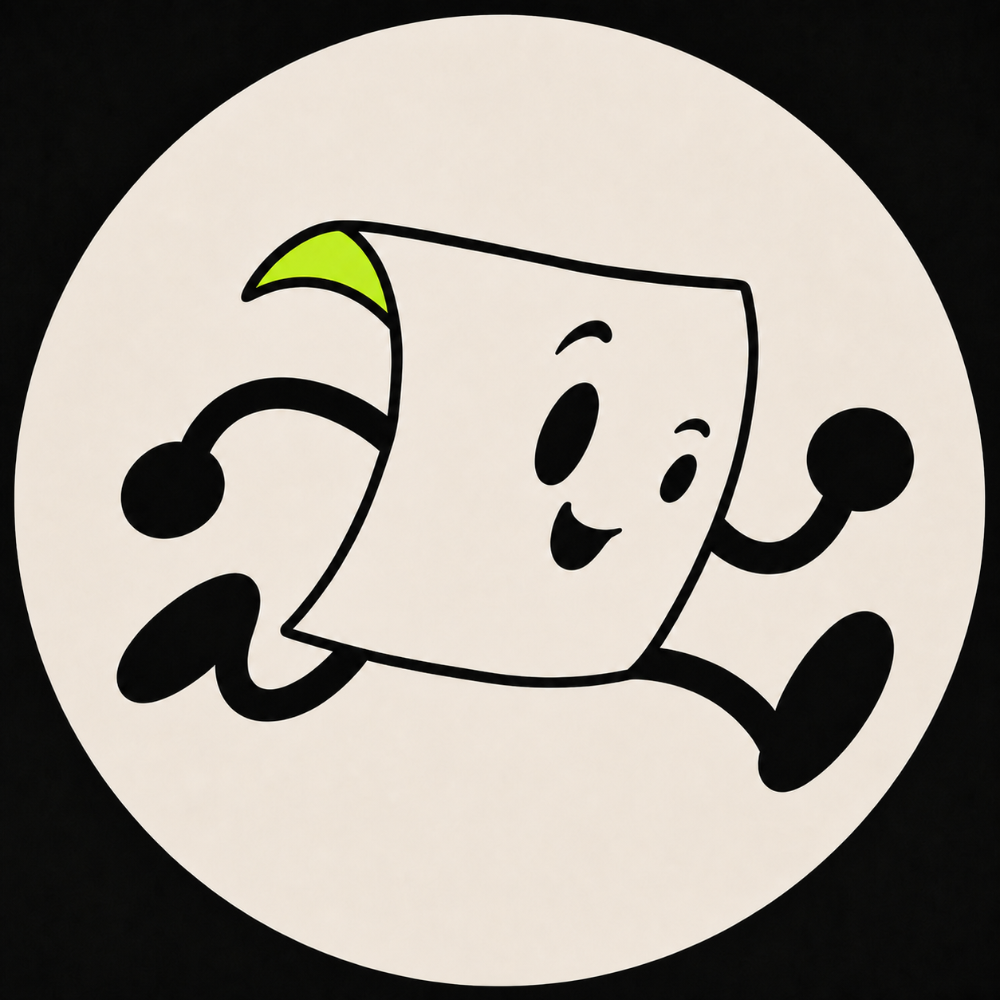

<p align="center">
  
</p>

<h1 align="center">Tradimation</h1>

Framework-neutral traditional-animation effects for existing web elements. Tradimation uses Web Animations API for DOM/SVG effects and a connected WebGL texture mesh for deformation effects. It has no React dependency and no runtime package dependency.

**Website:** [tradimation.github.io/tradimation](https://tradimation.github.io/tradimation/) · **Collection:** [Browse 14 motions and components](https://tradimation.github.io/tradimation/catalog.html)

Tradimation deliberately separates four scopes:

- **Core** owns controllers, timelines, cleanup, the registry, and renderers.
- **Effects** are reusable visual behaviors that attach to an existing element.
- **Recipes** show how an effect participates in a real control, state change, entrance, exit, or spatial handoff.
- **Components** own state, semantics, geometry, and one or more internal effects as a complete interaction example.

## Install and build

```bash
npm install
npm run build
```

## Basic use

```ts
import { playEffect } from "@tradimation/core";

const button = document.querySelector<HTMLButtonElement>("#save");

if (button) {
  const controller = playEffect(button, "wind-up-shift", {
    direction: "up",
    intensity: 0.9,
  });

  button.addEventListener("pointerleave", () => controller.reverse());
}
```

## Connected-texture effects

```ts
import { playEffect } from "@tradimation/core";

const card = document.querySelector<HTMLElement>(".product-card");
const cart = document.querySelector<HTMLElement>(".cart-icon");

if (card && cart) {
  playEffect(card, "suck-in", {
    destination: cart,
    overlayRoot: card.closest<HTMLElement>(".motion-stage"),
    bodyTravel: 0.5,
    columnLag: 0.3,
  });
}
```

The element is captured as one texture, rendered on one shared 32×14 WebGL mesh, and never split into independent DOM slices. Pass `overlayRoot` to keep coordinates, clipping, and travel relative to a component or preview stage; omit it for viewport-wide motion.

Existing transforms are preserved by default. Set `preserveTransform: false` only when an effect should replace the target's current transform completely.

## Component motion hooks

The documentation presents switches, tabs, and toasts as complete components that own state and semantics. Their internal motion hooks remain independently reusable: `toggle-snap` measures the knob's available travel from its track, and `tab-indicator-sweep` measures the destination tab instead of assuming equal-width labels.

```ts
playEffect(toggleKnob, "toggle-snap", { direction: checked ? "right" : "left" });
playEffect(tabUnderline, "tab-indicator-sweep", { destination: selectedTab });
```

## Explicit control

```ts
import { createEffect } from "@tradimation/core";

const controller = createEffect(element, "stamp-in", { duration: 770 });

await controller.play();
controller.seek(0.42);
controller.pause();
controller.reverse();
controller.cancel();
controller.destroy();
```

## Registry

```ts
import {
  components,
  definitions,
  EffectRegistry,
  effects,
  listEffects,
  recipes,
} from "@tradimation/core";

const manifests = listEffects(); // 14 curated definitions
const customRegistry = new EffectRegistry(definitions);

effects; // reusable visual techniques
recipes; // contextual UI integrations
components; // complete state-owning UI patterns
customRegistry.register(myCustomEffect);
```

The manifest layer is framework-neutral, so a React, Vue, Svelte, Web Component, or imperative adapter can wrap the same definitions without owning animation behavior.

## Site development

```bash
pnpm dev:site
```

The documentation site is a Svelte 5 multi-page app in `website/`. Production pages are generated into `site-dist/`, so every effect keeps a direct static URL on GitHub Pages. `cel-motion-gallery-v2.html` remains an archived internal motion reference and is not deployed.

See `EFFECTS.md` for the retention criteria and the effects removed during curation.
